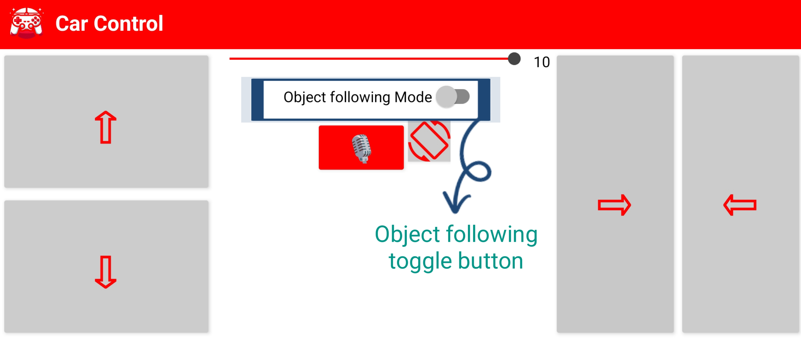

# 🤖 WiFi + Object Following Robot using NodeMCU, L298N, and HC-SR04

This project allows you to control a 4-wheel robot over WiFi using your custom mobile app. It also includes an object-following autonomous mode using the HC-SR04 ultrasonic sensor.

---

## Features:
- **Manual Control:** Dedicated areas for Forward/Backward movement and Left/Right steering.
- **Speed Adjustment:** A slider to set the car's Speed (1-10).
- **Voice Control:** A button to enable control via voice commands.
- **Autonomous Mode:** A toggle for Object Following Mode.
- **Motion Control:** A button to enable/disable specific motion or rotation controls.

---

## 🔧 Components Required

- 1 × NodeMCU (ESP8266)
- 1 × L298N Motor Driver Module
- 4 × Geared DC Motors
- 1 × HC-SR04 Ultrasonic Sensor
- 2 × 18650 Li-ion Batteries (7.4V Total)
- Jumper Wires and Chassis
- Arduino Studio Mobile App (for code upload)

---

## ⚙️ Pin Connections


### 🧠 Motor Driver (L298N) to NodeMCU:

| Function   | L298N Pin | NodeMCU Pin |
|------------|-----------|-------------|
| Enable A   | ENA       | D1          |
| Motor A   (pin 1) | IN1       | D2          |
| Motor A   (pin 2) | IN2       | D3          |
| Motor B   (pin 1) | IN3       | D4          |
| Motor B   (pin 2) | IN4       | D5          |
| Enable B   | ENB       | D6          |
| Power      | +12V      | Battery +   |
| GND        | GND       | Battery - and NodeMCU GND |

### 📡 Ultrasonic Sensor (HC-SR04) to NodeMCU:

| Function | Sensor Pin | NodeMCU Pin |
|----------|------------|-------------|
| Trig     | Trig       | D7          |
| Echo     | Echo       | D8          |
| Power    | VCC        | 3V          |
| Ground   | GND        | GND         |
> if you use **4 motors** , then add the 2 motors at **motor A** and 2 motors at **motor B**
---

## 🧪 Library Installation 

1. Install **ESP8266 Board**:
   - Open Arduino Studio
   - Add this URL in Board Manager:
     ```
     http://arduino.esp8266.com/stable/package_esp8266com_index.json
     ```
   - Install `esp8266 by ESP8266 Community`

2. Select Board: **NodeMCU 1.0 (ESP-12E Module)**

> **All required libraries (`ESP8266WiFi`, `ESP8266WebServer`, and `ArduinoOTA`) should be downloaded.**

---

## 📲 App Commands

Use your app to send HTTP requests to the robot (e.g., `http://192.168.4.1/?State=F`):

| Command | Action               |
|---------|----------------------|
| `F`     | Forward              |
| `B`     | Backward             |
| `L`     | Turn Left            |
| `R`     | Turn Right           |
| `S`     | Stop                 |
| `U_1`   | Enable Object Follow |
| `U_0`   | Disable Object Mode  |

> Use the given app to control the car
---

## 🚦 Modes

- **Manual (Remote Control)**: Default mode, control using app.
- **Object Following**: Enabled via `U_1`, robot maintains a 10 cm distance from objects using ultrasonic sensor.
- **Switch Back to Manual**: Send `U_0`.

---

## 🔌 Powering Up

- Use 2 × 18650 cells (7.4V) to power the L298N.
- L298N supplies 5V to NodeMCU via onboard regulator.
- Use USB power only for uploading code.

---

## 🔄 OTA Updates

Once code is uploaded once, further updates can be done wirelessly:
- Robot appears under **Tools > Port > Network Ports** (e.g., `wificar-xxxx.local`)

---

## 💡 Notes

- Keep ENA/ENB jumpers removed for PWM speed control.
- Use a voltage divider for the Echo pin to avoid over-voltage on NodeMCU.
- Default distance threshold: 10 cm (modifiable via `distanceKeep` variable).

---

## 📱App Controls

### Joystick controlls:


### Speed Adjustment:

### Voice controlling :

### motion controlling :

### object following Mode toggle :


---

#### Happy Building! 🚀

---

Shield: [![CC BY-NC 4.0][cc-by-nc-shield]][cc-by-nc]

This work is licensed under a
[Creative Commons Attribution-NonCommercial 4.0 International License][cc-by-nc].

[![CC BY-NC 4.0][cc-by-nc-image]][cc-by-nc]

[cc-by-nc]: https://creativecommons.org/licenses/by-nc/4.0/
[cc-by-nc-image]: https://licensebuttons.net/l/by-nc/4.0/88x31.png
[cc-by-nc-shield]: https://img.shields.io/badge/License-CC%20BY--NC%204.0-lightgrey.svg
